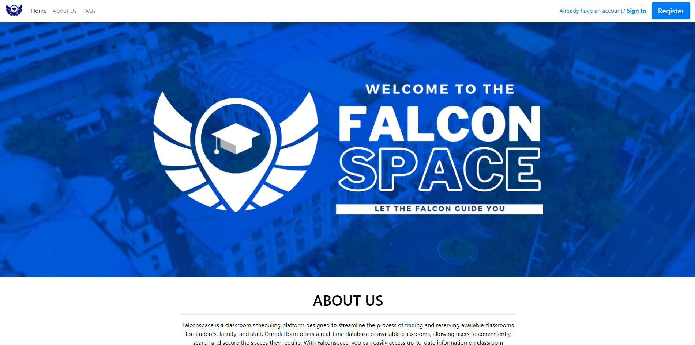
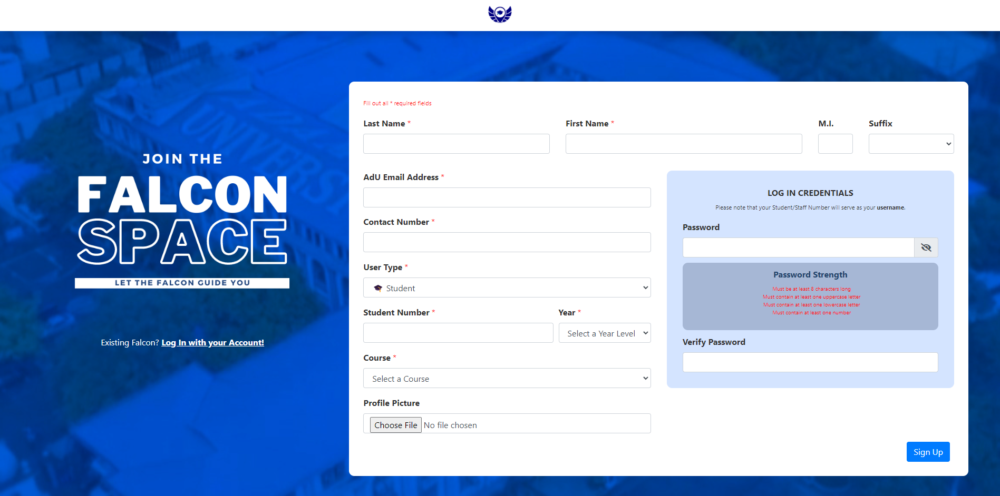
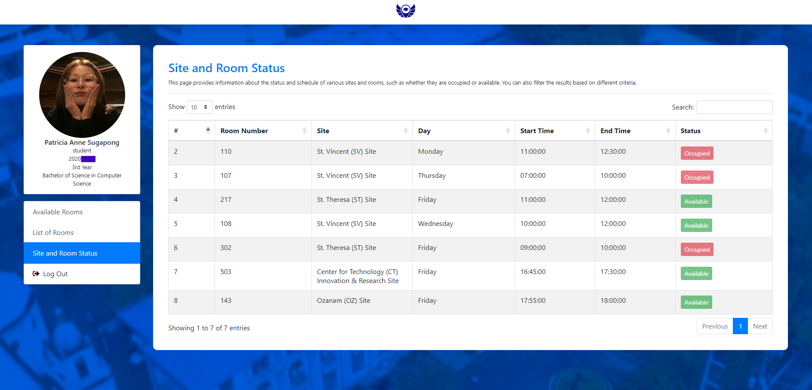
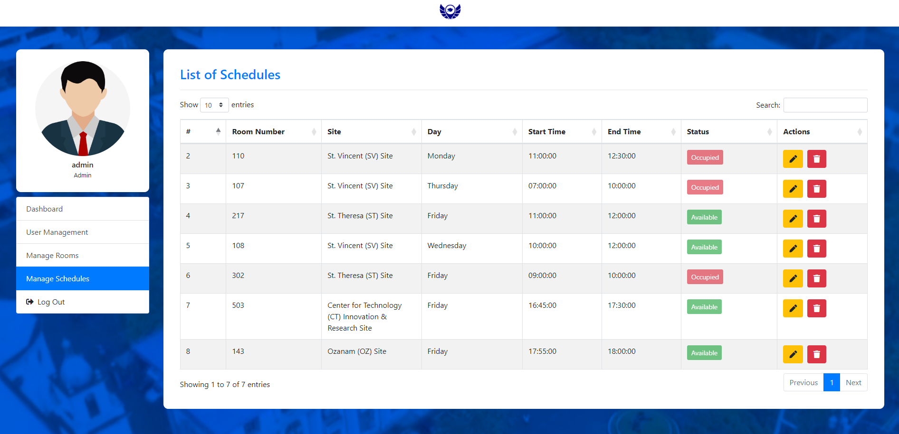

  

## Project Overview

FalconSpace is a web-based application developed to address the challenge of limited communal study spaces at Adamson University. It offers a real-time view of classroom availability, enabling students and faculty to quickly find open classrooms. The user-friendly interface, accessible from any internet-enabled device, simplifies the process of checking classroom occupancy. Admins update classroom statuses in real-time, ensuring accurate information. FalconSpace enhances the campus experience by providing a convenient solution for managing study spaces and reducing overcrowding.

## Key Features

- **User Registration & Login:** Secure account creation and access with AdU email and Student/Staff Number.
- **Profile Management:** Update personal information and upload a profile photo.
- **Password & Input Validation:** Enforces strong passwords and validates user inputs.
- **Classroom Availability:** View available classrooms and their status.
- **Schedule & Filter Functionality:** Access schedules and filter results based on criteria.
- **Administration Section:** Manage users, rooms, and schedules.

## Technologies Used
- 
- 
- 
- 

## Screenshots

  
  
  
  
  

## Team

This project was developed by:

- [Patricia Anne E. Sugapong](https://github.com/PatriciaSugapong) - Full Stack Developer
